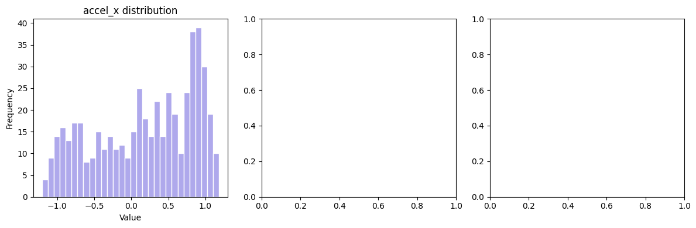
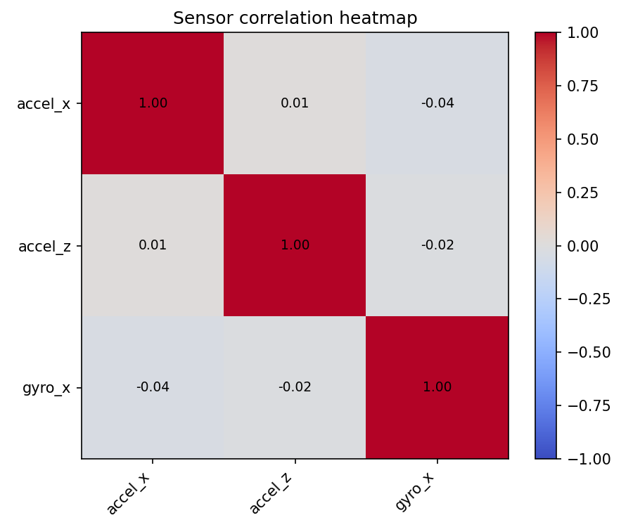

# 🤖 Robot Sensor Data Explorer


A beginner robotics ML project that performs exploratory 
data analysis (EDA) on simulated IMU sensor data from a 
robot arm. Built as part of my 30-day ML robotics learning roadmap.

---

## 📌 Project Summary

In real robotics systems, robot arms are equipped with 
**IMU sensors** (Inertial Measurement Units) that constantly 
measure movement and rotation. Before any machine learning 
model can be built, engineers must first **understand the data** 
— cleaning it, computing statistics, and visualising patterns.

This project does exactly that.

---

## 🎯 What this project does

- Simulates 500 readings from a robot arm IMU sensor
- Cleans and validates the data using Pandas
- Engineers a new feature: **total acceleration magnitude** 
  (combining X, Y and Z axes into one value)
- Computes key statistics: mean, std, min, max per sensor
- Produces 4 professional charts for analysis

---

## 📊 Charts produced

### 1. Sensor readings over time
Shows accelerometer and gyroscope readings across 10 seconds


### 2. Acceleration magnitude over time
Total movement strength with average reference line


### 3. Sensor value distributions
Histograms showing how each sensor reading is distributed



### 4. Sensor correlation heatmap
Shows which sensors move together — critical insight for ML 
feature selection



---

## 💡 Key findings

- Mean acceleration magnitude ≈ 9.87 m/s² — dominated by 
  gravity on the Z axis (9.8 m/s²)
- Accelerometer X and Y show sinusoidal patterns — 
  consistent with a rotating robot arm
- Gyroscope readings centred near 0 — robot is stable 
  with low angular velocity
- Low correlation between accelerometer and gyroscope 
  readings — both sensors provide unique, non-redundant information

---

## 🧰 Tech stack

| Tool | Purpose |
|---|---|
| Python 3 | Core programming language |
| NumPy | Array operations and statistics |
| Pandas | Data loading, cleaning and exploration |
| Matplotlib | Data visualisation |
| Jupyter / Colab | Development environment |

---

## 🚀 How to run

**Option 1 — Google Colab (recommended)**

Click here → [Open in Colab](https://colab.research.google.com/)
then upload the `1_sensor_explorer.ipynb` file

**Option 2 — Local setup**

```bash
pip install numpy pandas matplotlib jupyter
jupyter notebook 1_sensor_explorer.ipynb
```

---
## 📁 Project structure
robot-sensor-explorer/
│
├── 1_sensor_explorer.ipynb   ← main notebook (all code)
├── 2_plot1_timeseries.png    ← sensor readings over time
├── 3_plot2_magnitude.png     ← acceleration magnitude chart
├── 4_plot3_histogram.png     ← sensor distributions
├── 5_plot4_heatmap.png       ← correlation heatmap
└── README.md                 ← you are here

---

## 🗺️ Part of my 30-day ML robotics roadmap

| Week | Project | Status |
|---|---|---|
| Week 1 | Robot sensor data explorer | ✅ Complete |
| Week 2-3 | Robot fault detection classifier | ✅ Complete |
| Week 3-4 | Real-time object detector | ⏳ Coming soon |

---

## 👤 About

Built with the help of my developer mentor-friend, some materials and a touch of AI
Focused on real-world robotics applications of machine learning.

