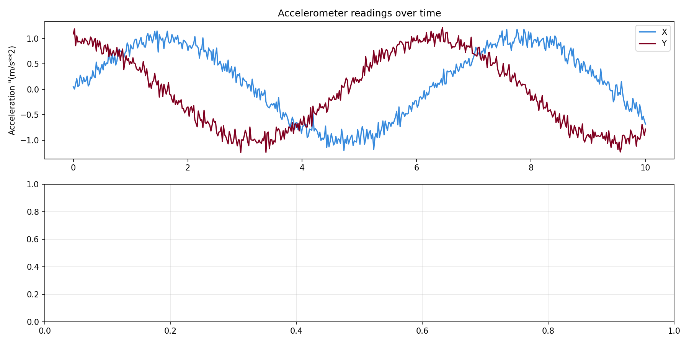
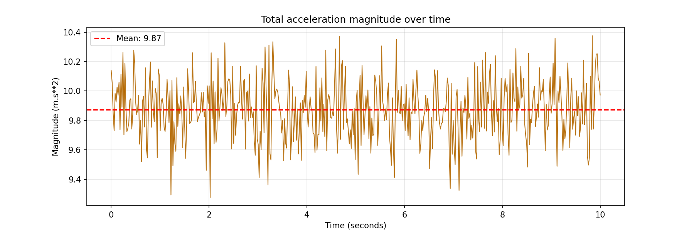

# Robot Sensor Data Explorer

An exploratory data analysis of IMU robot sensor data 
using NumPy, Pandas and Matplotlib.

## What it does
- Loads and cleans accelerometer and gyroscope sensor data
- Computes key statistics (mean, std, min, max) per sensor axis
- Calculates total acceleration magnitude
- Visualises sensor readings, distributions and correlations

## Charts

## Tools used
Python · NumPy · Pandas · Matplotlib · Jupyter

## How to run
pip install numpy pandas matplotlib jupyter
jupyter notebook sensor_explorer.
